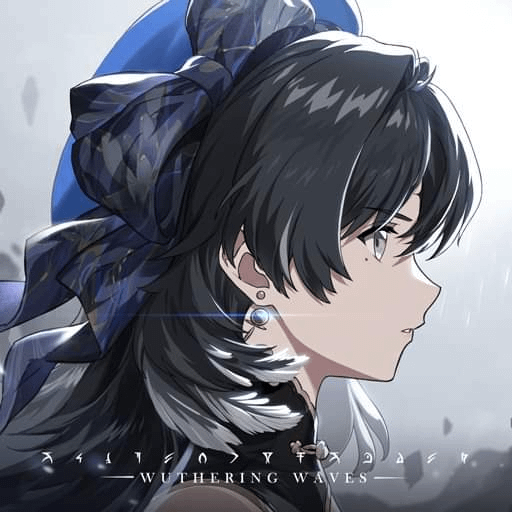

<div align="center">

  

# WuwaVH Linux Launcher

Launcher Việt Hóa Wuthering Waves trên Linux (Steam / Heroic).

  <p align="center">
    <a href="https://github.com/jingjo07/WuwaVH-Linux-Launcher/releases"></a>
    <a href="https://discord.com/invite/uNRyaHJR6"></a>
    <a href="#"></a>
    <a href="#"></a>
  </p>

  <br>

</div>

---

## 📌 Tính năng chính

- **Tải và cài đặt Việt Hóa**: Tự động tải bản dịch mới nhất từ DangDev (Iris Team)
- **Tùy chỉnh giao diện**: Hỗ trợ 3 giao diện (Cyber, Modern, Classic), kèm video và nhạc nền tùy chọn.
- **Chỉnh cấu hình đồ họa (Engine.ini)**:
  - Chọn sẵn một số preset cấu hình. (Nguồn: [AlteriaX](https://github.com/AlteriaX/WuWa-Configs))
  - Có nút khôi phục lại file gốc nếu gặp lỗi.
- **Đổi font chữ trong game**: Hỗ trợ nạp file font `.ttf`, `.otf` hoặc file `.pak` có sẵn để đổi font chữ hiển thị trong game.
- **Hỗ trợ Steam & Heroic**: Tự nhận diện đường dẫn cài đặt game và hỗ trợ nạp cấu hình `WINEDLLOVERRIDES` trên Wine/Proton.

---

## 📥 Cách cài đặt và sử dụng

### 1. Dùng file AppImage (Khuyên dùng)

Tải file chạy trực tiếp ở mục [Releases](https://github.com/jingjo07/WuwaVH-Linux-Launcher/releases):

```bash
chmod +x WuWaVH-Launcher-x86_64.AppImage
./WuWaVH-Launcher-x86_64.AppImage
```

### 2. Chạy từ mã nguồn

Nếu muốn chạy trực tiếp bằng Python, máy cần cài sẵn Python 3, WebKit2GTK và Aria2:

- **Arch Linux / CachyOS / Manjaro**:
  ```bash
  sudo pacman -S python webkit2gtk-4.1 aria2
  ```
- **Ubuntu / Debian**:
  ```bash
  sudo apt install python3 python3-gi gir1.2-webkit2-4.1 aria2
  ```
- **Fedora**:
  ```bash
  sudo dnf install python3 python3-gobject webkit2gtk4.1 aria2
  ```

Sau đó clone repo và khởi chạy:

```bash
git clone https://github.com/jingjo07/WuwaVH-Linux-Launcher.git
cd WuwaVH-Linux-Launcher
python3 launcher.py
```

---

## ⚙️ Thiết lập trên Steam

Để Proton nạp file `winhttp.dll` và nhận bản Việt Hóa khi mở game từ Steam:

### 1. Gắn WINEDLLOVERRIDES bằng launcher.

1. Tắt hoàn toàn Steam (Nếu đang bật).
2. Bấm vào nút `≡` -> `Cài WINEDLLOVERDRIVES`.

_(Lúc này launcher sẽ tự động cài cho bạn `WINEDLLOVERDRIVES`, bạn đã có thể vào game chơi như bình thường)_.

### 2. Gắn WINEDLLOVERRIDES trực tiếp trên steam.

1. Chuột phải vào **Wuthering Waves** trong thư viện Steam ➔ Chọn **Properties...**
2. Ở tab **General**, tìm phần **Launch Options** và điền:
   ```text
   WINEDLLOVERRIDES="winhttp=n,b" %command%
   ```
   _(Nếu muốn chạy ở chế độ DirectX 11, thêm `-dx11` vào cuối: `WINEDLLOVERRIDES="winhttp=n,b" %command% -dx11`)_.

---

## 🔨 Đóng gói file AppImage

Nếu bạn muốn tự build lại file `.AppImage`:

```bash
chmod +x build_appimage.sh
./build_appimage.sh
```

File đóng gói sẽ được tạo ra tại thư mục hiện tại: `WuWaVH-Launcher-x86_64.AppImage`.

---

## 💬 Cộng đồng & Hỗ trợ

Tham gia máy chủ Discord để cùng thảo luận, cập nhật thông tin về Việt Hóa WUWA và những game khác:  
👉 **[Tham gia máy chủ Discord IRIS](https://discord.com/invite/uNRyaHJR6)**

---

## 🤝 Nguồn Việt Hóa

- Dữ liệu bản dịch Việt Hóa từ **DangDevVH**.

## ⚠️ Lưu Ý

- Tôi không thuộc team Việt Hóa IRIS Team, nên nếu Launcher có vấn đề hãy trực tiếp báo lỗi trên Issues.
